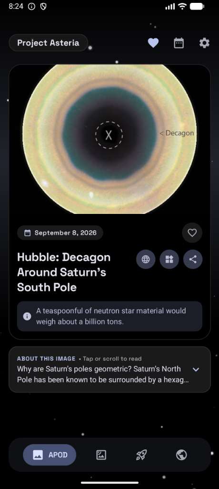
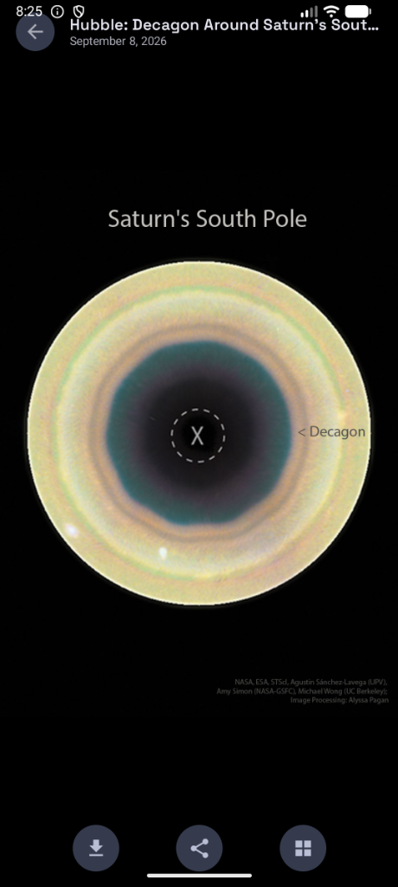
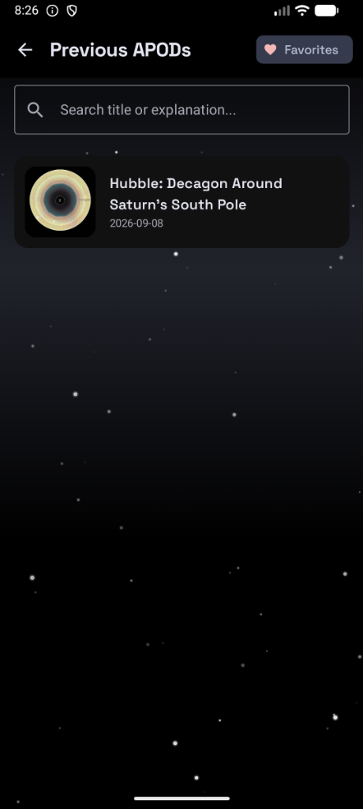
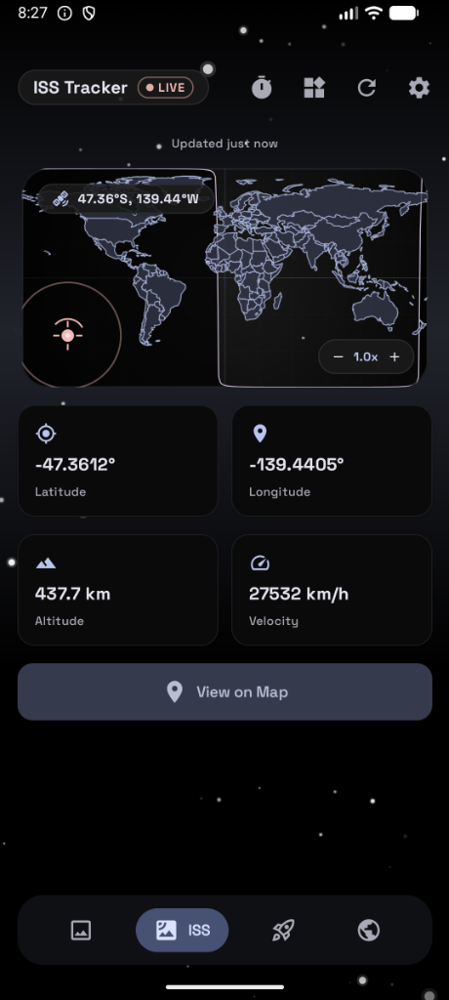
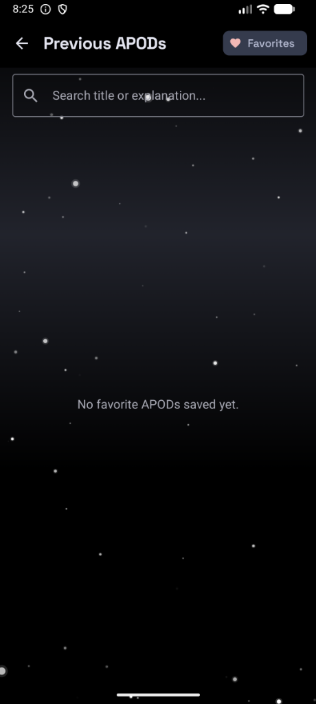

# Project Asteria
<p align="center">
  
</p>

<!-- Small shield badges -->
<p align="center">
  
  
  
  
  
</p>

<!-- Large F-Droid download badge -->
<p align="center">
  <a href="https://f-droid.org/packages/space.o4bit.projectasteria.foss">
    
  </a>
</p>
A Free and Open Source (FOSS) Android application for space exploration using official NASA APIs.

## Screenshots

<p align="center">
  
  
  
</p>

<p align="center">
  
  
</p>

## Features

- **Astronomy Picture of the Day (APOD)** — daily NASA image with high-resolution support, explanations, video handling, and shareable content.
- **Near-Earth Object (NEO) Tracking** — real-time asteroid data with miss-distance and hazard classification.
- **Space Launch Tracker** — upcoming launch schedule via The Space Devs API with countdown animations.
- **ISS Tracker** — live International Space Station position using the Where The ISS At? API.
- **APOD History Gallery** — paged history of past astronomy pictures with a date picker.
- **Home Screen Widget** — configurable widget that updates daily with the current APOD.
- **Offline Support** — Room-powered local cache keeps content available when offline. An indicator shows when the app is running in cached mode.
- **100% telemetry-free** — no analytics, no crash reporting to external services. Diagnostic logs stay local and are only exported on explicit user request.

## Installation

1. Clone the repository:
   ```bash
   git clone https://github.com/O4bit/Project-Asteria.git
   ```
2. Open the project in Android Studio (Ladybug or newer recommended).
3. Sync Gradle and build the project.
4. Run the `app` module on a device or emulator running Android 12 (API 31) or higher.

> **F-Droid:** The app is distributed on F-Droid. Reproducible builds are configured via `app/build.gradle.kts`.


## Building

```bash
# Debug
./gradlew assembleDebug

# Release (requires signing config)
./gradlew assembleRelease

# Unit tests
./gradlew testDebugUnitTest

# Lint (with baseline — only new violations will fail the build)
./gradlew lintRelease
```

### Lint Baseline

The project maintains a `app/lint-baseline.xml` that captures all pre-existing lint warnings so that only **new** violations block the release build. When you fix existing warnings, regenerate the baseline with:

```bash
./gradlew updateLintBaseline
```

## Contributing

Contributions are welcome via GitHub Pull Requests.

1. Open an issue first for major changes.
2. Follow the Kotlin coding standards already in the project.
3. Add or update unit tests in `app/src/test/` for any business logic you change.
4. Run `./gradlew testDebugUnitTest lintRelease` before submitting your PR.
5. Do not introduce new dependencies that require non-free network services without a discussion.

See [CONTRIBUTING.md](CONTRIBUTING.md) if present for detailed guidelines.

## Security

To report a security vulnerability, please use [GitHub's private vulnerability reporting](https://github.com/O4bit/Project-Asteria/security/advisories/new).  
See [SECURITY.md](SECURITY.md) for the full disclosure policy.

## License

This project is licensed under the MIT License. See the [LICENSE](LICENSE) file for details.
