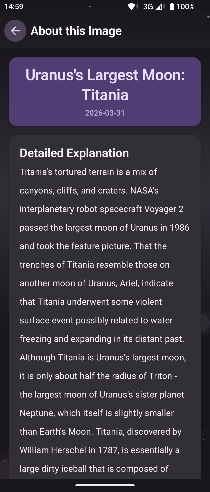
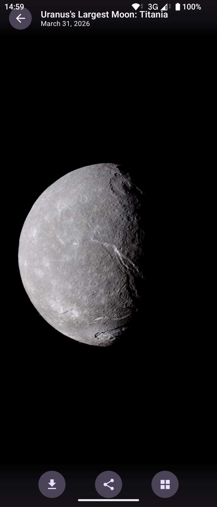
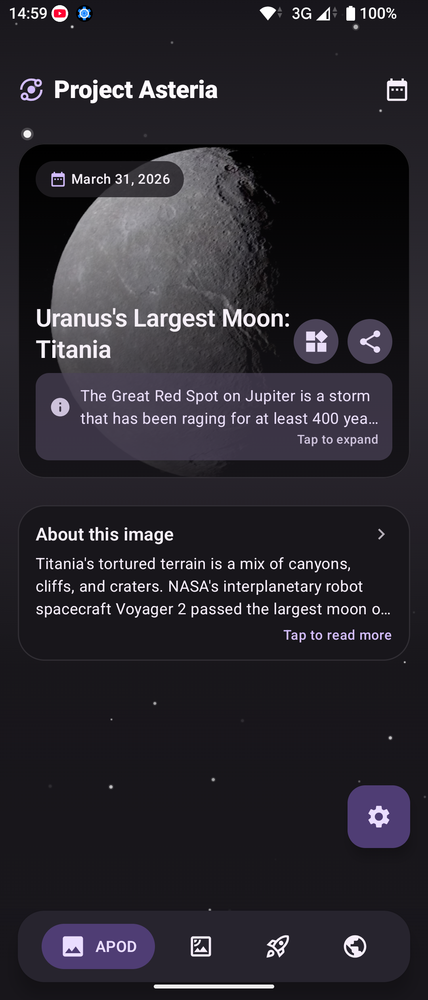
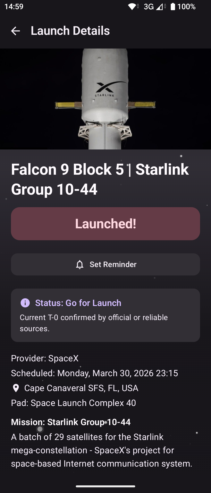
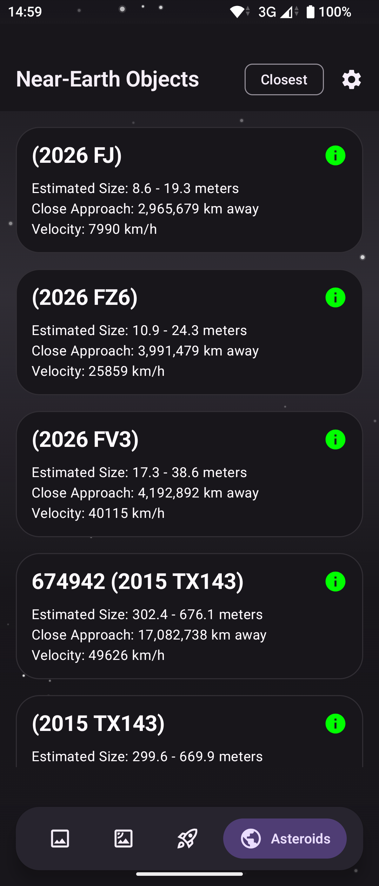
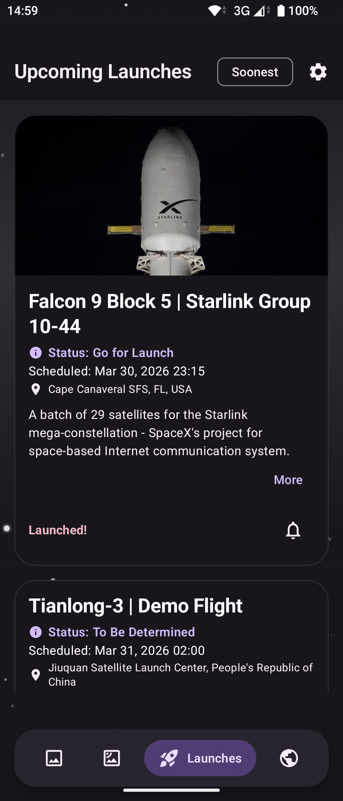

# Project Asteria

<p align="center">
  
</p>

<p align="center">
  
  
</p>

A Free and Open Source (FOSS) Android application for space exploration using official NASA APIs.

## Screenshots

<p align="center">
  
  
  
</p>

<p align="center">
  
  
  
</p>

## Features

- Astronomy Picture of the Day (APOD) with high-resolution image support and detailed explanations.
- Near-Earth Object (NEO) tracking and data visualization.
- Space mission insights and historical data.
- Built with Jetpack Compose for a modern, responsive interface.
- 100% telemetry-free and privacy-focused.

## Installation

1. Clone the repository:
   ```bash
   git clone https://github.com/O4bit/Project-Asteria.git
   ```
2. Open the project in Android Studio (Ladybug or newer recommended).
3. Sync Gradle and build the project.

## Usage

Build and run the `app` module on an Android device or emulator (API level 31 or higher).

## Contributing

Contributions are welcome via GitHub Pull Requests. Please ensure your code follows the project's Kotlin coding standards and includes relevant unit tests where applicable. For major changes, please open an issue first to discuss your proposal.

## Code of Conduct

Everyone participating in this project is expected to treat others with respect and maintain a professional environment. Aggressive, exclusionary, or harassing behavior is not tolerated.

## Security

To report a security vulnerability, please open a confidential issue or contact the maintainer directly. Do not disclose vulnerabilities in public issues until a fix has been prepared.

## License

This project is licensed under the MIT License. See the [LICENSE](LICENSE) file for details.
